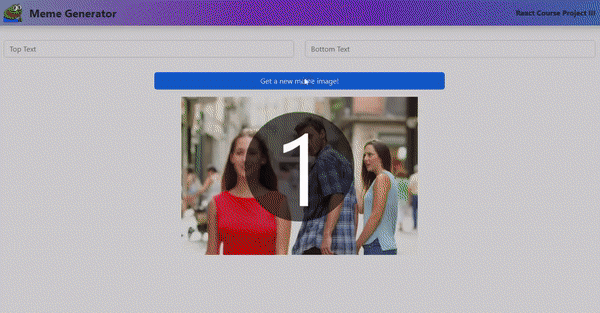

# Meme-generator

Third project from scrimba's [react course](https://scrimba.com/learn/learnreact)

This project is hoted on netlify. View the live site [here](https://scotty-meme-generator.netlify.app/).



# About

Just as the name of the project says, it's a meme generator.

- To generate random meme images, click on the `Get a new meme image!` button.
- To add texts to your chosen meme image, populate the text input form above. (as shown on the site preview above)

# Local Development

1. To clone this repository, type in your terminal (or copy)

   ```
   git clone https://github.com/scott-gianan/meme-generator.git
   ```

2. Change to the meme-generator directory

   ```
   cd meme-generator
   ```

3. Install the necessary dependencies

   ```
   npm install
   ```

4. Run this repository locally

   ```
   npm run preview
   ```

5. Head on to your browser address bar and type (or copy the link):

   ```
   http://localhost:8080/
   ```

---
